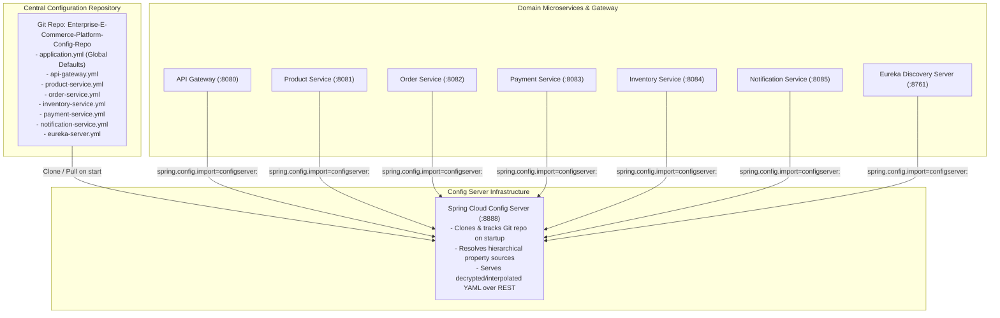

# Enterprise E-Commerce Platform — Centralized Config Repository

[](https://spring.io/projects/spring-cloud-config)
[](https://git-scm.com/)
[](https://microservices.io/)

This repository serves as the externalized, centralized configuration source for the **Enterprise E-Commerce Microservices Platform**. Backed by **Spring Cloud Config Server**, it externalizes application configuration across environments without requiring microservices to be rebuilt or redeployed when properties change.

---

## Architecture & Configuration Flow



### Property Hierarchy & Inheritance
Spring Cloud Config Server uses a hierarchical property resolution model:
1. **`application.yml` (Base Layer):** Applies to **all** consuming microservices. Contains shared settings: Zipkin distributed tracing sampling and endpoint, Prometheus metrics exposure, and Resilience4j circuit breaker actuators.
2. **`{service-name}.yml` (Service Layer):** Overrides and extends `application.yml` with service-specific configurations (routes, datasources, Kafka topics/serializers, rate limiting, and cache TTLs).
3. **`{service-name}-{profile}.yml` (Profile Layer, e.g., `dev`, `docker`, `prod`):** Environment-specific overrides.
4. **Operating System Environment Variables:** Injected at container runtime to override any YAML values (Twelve-Factor App principle).

---

## Repository Structure

```text
Enterprise-E-Commerce-Platform-Config-Repo/
├── .gitignore
├── README.md                   # This documentation
├── application.yml             # Global configurations shared by all microservices
├── api-gateway.yml             # Edge routes, Keycloak OAuth2 JWKS, Redis rate limiter
├── eureka-server.yml           # Netflix Eureka discovery registry settings
├── product-service.yml         # PostgreSQL productdb, Redis cache TTL, CQRS read settings
├── order-service.yml           # Apache Kafka serializers, Resilience4j (CB, Retry, Bulkhead)
├── inventory-service.yml       # Kafka consumers, stock reservation channels
├── payment-service.yml         # Kafka consumers, idempotency repository, failure rate test knob
└── notification-service.yml    # Kafka consumer group, JSON deserializer trust boundaries
```

---

## Service Configuration Breakdown

| File | Port | Key Managed Configurations |
| :--- | :--- | :--- |
| **[`application.yml`](application.yml)** | Shared | Shared Zipkin tracing (`sampling.probability: 1.0`), Actuator metrics (`health,info,prometheus,metrics`), and circuit breaker health indicators. |
| **[`api-gateway.yml`](api-gateway.yml)** | `8080` | Spring Cloud Gateway routes (`/api/v1/products/**`, `/api/v1/orders/**`, etc.), Redis Token Bucket Rate Limiter (`10 tokens/s`, `burst 20`), Keycloak JWKS verification URI, and public route white-listing. |
| **[`eureka-server.yml`](eureka-server.yml)** | `8761` | Eureka server flags (`register-with-eureka: false`, `fetch-registry: false`). |
| **[`product-service.yml`](product-service.yml)** | `8081` | PostgreSQL datasource (`productdb`), Redis cache manager (`time-to-live: 300000ms`, `cache-null-values: false`), Hibernate DDL auto update. |
| **[`order-service.yml`](order-service.yml)** | `8082` | Kafka bootstrap servers, Json serializers/deserializers, Resilience4j Circuit Breaker (sliding window: 10, failure rate: 50%), Exponential Backoff Retry (3 attempts), and Bulkhead limits. |
| **[`inventory-service.yml`](inventory-service.yml)** | `8084` | Kafka consumer groups, stock event listeners, compensation channels. |
| **[`payment-service.yml`](payment-service.yml)** | `8083` | Kafka consumer groups, idempotency handling, test failure rate knobs. |
| **[`notification-service.yml`](notification-service.yml)** | `8085` | Kafka consumer group `notification-service`, JSON deserializer trusted packages (`*`), Kafka health indicator. |

---

## Environment Variable Reference

All configurations use Spring environment variable placeholders (`${VARIABLE_NAME:fallback_value}`). This guarantees seamless operation both in **local host mode** and inside **Docker Compose**:

| Environment Variable | Target Service(s) | Default (Host Dev) | Docker Compose Value |
| :--- | :--- | :--- | :--- |
| `SPRING_DATA_REDIS_HOST` | `api-gateway`, `product-service` | `localhost` | `redis` |
| `SPRING_DATA_REDIS_PORT` | `api-gateway`, `product-service` | `6379` | `6379` |
| `SPRING_DATASOURCE_URL` | `product-service` | `jdbc:postgresql://localhost:5432/productdb` | `jdbc:postgresql://postgres:5432/productdb` |
| `SPRING_DATASOURCE_USERNAME` | `product-service` | `postgres` | `postgres` |
| `SPRING_DATASOURCE_PASSWORD` | `product-service` | `postgres` | `postgres` |
| `SPRING_KAFKA_BOOTSTRAP_SERVERS` | `order`, `inventory`, `payment`, `notification` | `localhost:9092` | `kafka:9092` |
| `EUREKA_CLIENT_SERVICEURL_DEFAULTZONE` | All services | `http://localhost:8761/eureka/` | `http://eureka-server:8761/eureka/` |
| `KEYCLOAK_JWK_SET_URI` | `api-gateway` | `http://keycloak:8080/realms/ecommerce-platform/protocol/openid-connect/certs` | `http://keycloak:8080/realms/ecommerce-platform/protocol/openid-connect/certs` |
| `MANAGEMENT_ZIPKIN_TRACING_ENDPOINT` | All services | `http://zipkin:9411/api/v2/spans` | `http://zipkin:9411/api/v2/spans` |

---

## Verifying & Testing Config Server Endpoints

When the Spring Cloud Config Server is running (port `8888`), you can query resolved properties directly via HTTP:

### 1. View Service Configuration Profile
```http
GET http://localhost:8888/{service-name}/{profile}
```
**Examples:**
```bash
# Query product-service default profile
curl http://localhost:8888/product-service/default

# Query api-gateway default profile
curl http://localhost:8888/api-gateway/default

# Query order-service default profile
curl http://localhost:8888/order-service/default
```

### 2. View Raw Formatted YAML
```http
GET http://localhost:8888/{service-name}-{profile}.yml
```
**Example:**
```bash
curl http://localhost:8888/product-service-default.yml
```

### 3. Verify Health of Config Server
```bash
curl http://localhost:8888/actuator/health
# Response: {"groups":["liveness","readiness"],"status":"UP"}
```

---

## Best Practices & Security Guidelines

1. **Zero Hardcoded Secrets:** Never commit production database passwords, JWT signing secrets, API tokens, or TLS private keys to this repository.
2. **Use Environment Variable Interpolation:** Always format sensitive properties as `${SECRET_ENV_VAR:dev-fallback}` so production secrets can be injected via Docker secrets, Kubernetes Secrets, or HashiCorp Vault.
3. **Immutable Property Names:** When adding or renaming properties, ensure consuming microservice DTOs and `@Value` / `@ConfigurationProperties` classes are updated simultaneously.
